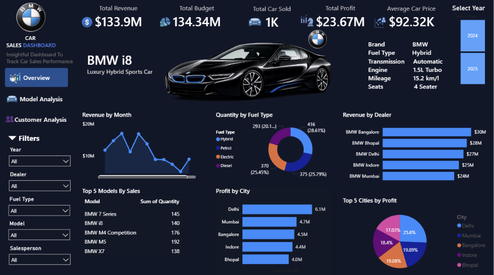

# 🚗 Interactive BMW Car Sales Dashboard | Power BI | Excel | DAX | Data Visualization

## 📌 Project Overview
This project is an interactive Power BI dashboard developed to analyze BMW car sales performance. It provides insights into revenue, profit, sales trends, customer analysis, and model performance using interactive visualizations.

## 📊 Dashboard Features
- Revenue Analysis
- Profit Analysis
- Sales Trend by Month
- Customer Analysis
- Model Analysis
- Dealer-wise Revenue
- City-wise Profit
- Fuel Type Analysis
- Interactive Filters
- Year Selection

## 🛠 Tools Used
- Power BI
- Microsoft Excel
- DAX
- Power Query

## 📂 Files Included
- BMW_CAR_SALES_DASHBOARD.pbix
- BMW_Car_Sales_Dataset.xlsx
- BMW_CAR_SALES_DASHBOARD.pdf

## 📸 Dashboard Preview

## 📊 Key Insights

- The dashboard reports approximately **$133.9M in total revenue** and **$23.67M in total profit**.
- **BMW 5** is the highest-selling model among the displayed models, with **192 units sold**.
- **BMW Bangalore** generates the highest dealer-wise revenue at approximately **$30M**, followed by BMW Bhopal at **$28M**.
- **Delhi** has the highest profit among the displayed cities at approximately **$6.1M**.
- Among the displayed fuel types, **Hybrid** has the highest quantity at **416 units (28.61%)**.
- **Petrol** accounts for **375 units (25.79%)**, while **Electric** accounts for **370 units (25.45%)**.
- The monthly revenue trend shows **noticeable fluctuations**, indicating variation in sales performance across months.
- Among the top five cities by profit, **Delhi contributes the largest share at approximately 25.6%**.

## 💡 Business Recommendations

- Focus on high-performing models such as **BMW 5** to support sales growth.
- Analyze the performance strategies of **BMW Bangalore** and **BMW Bhopal** to improve other dealerships.
- Identify the factors contributing to higher profitability in **Delhi** and apply successful strategies to other cities.
- Monitor customer demand across **Hybrid, Petrol, and Electric** vehicles to support future product planning.
- Investigate monthly sales fluctuations to identify high-performing periods and improve sales during weaker months.

## 👩‍💻 Author
**Princy Dubey**
